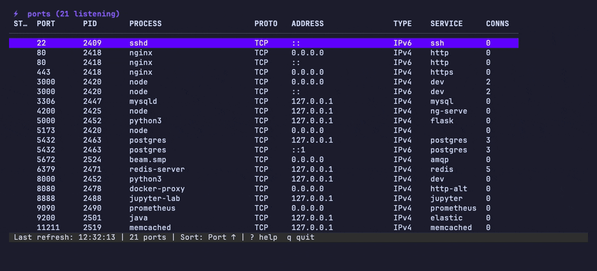
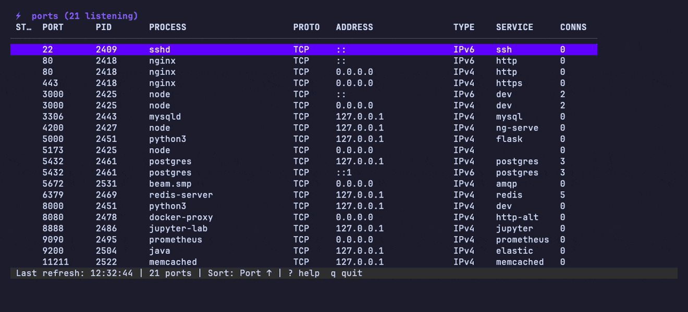
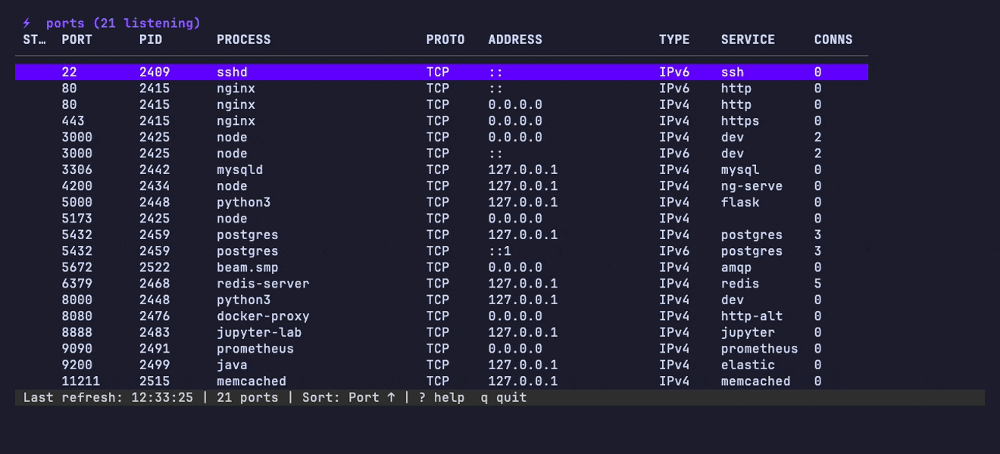

# ports

A fast, keyboard-driven TUI for exploring listening ports on macOS and Linux.


## Features

- Live auto-refresh every 2 seconds
- Filter ports by number, process name, or service
- Kill processes with SIGTERM (`x`) or SIGKILL (`X`)
- Open ports in browser (`o` → `http://localhost:<port>`)
- Copy port info to clipboard (`c`)
- Sort by port, PID, or process name (`s`)
- Toggle TCP / UDP / both (`t`)
- Merge duplicate IPv4+IPv6 entries (`m`)
- Service name hints (http, postgres, redis, etc.)
- Connection count column
- Status markers: `●` new ports, `○` disappeared ports
- `--port` flag to pre-filter on startup
- `--diff` mode for one-shot CLI diff

## Requirements

- macOS or Linux
- Go 1.21 or newer (for building from source)

## Installation

### Homebrew (macOS)

```bash
brew tap shahadulhaider/tap
brew install ports
```

### go install (recommended)

```bash
go install github.com/shahadulhaider/ports/cmd/ports@latest
```

### Download binary

Pre-built binaries for macOS and Linux are available on the [GitHub Releases](https://github.com/shahadulhaider/ports/releases) page.

### Build from source

```bash
git clone https://github.com/shahadulhaider/ports
cd ports
make build
./ports
```

## Usage

```bash
# Launch TUI
ports

# Check version
ports --version

# Pre-filter to a specific port
ports --port 3000

# Show changes since last run (non-interactive)
ports --diff
```

## Keybindings

| Key | Action |
|-----|--------|
| `↑/↓` or `j/k` | Navigate rows |
| `/` | Filter ports |
| `Esc` | Clear filter |
| `x` | Kill process (SIGTERM) |
| `X` | Force kill (SIGKILL) |
| `o` | Open in browser |
| `c` | Copy to clipboard |
| `s` | Cycle sort mode |
| `t` | Toggle TCP / UDP / Both |
| `m` | Toggle merge IPv4+IPv6 |
| `r` | Refresh now |
| `?` | Toggle help overlay |
| `q` / `Ctrl+C` | Quit |

## Flags

| Flag | Description |
|------|-------------|
| `--version` | Print version and exit |
| `--port <N>` | Pre-filter to specific port on startup |
| `--diff` | Show changes since last run and exit |

## Demo

<details>
<summary><b>Filter</b> — narrow by port, process, or service</summary>

Press `/` and type. Matching runs across port number, process name, address, and
service hint, so `3000`, `redis`, and `node` all work.



</details>

<details>
<summary><b>Sort, merge, and protocol toggle</b></summary>

`s` cycles through Port ↑ / Port ↓ / PID / Process. `m` merges duplicate
IPv4+IPv6 rows into a single entry marked `4+6`. `t` switches between TCP, UDP,
and both.



</details>

<details>
<summary><b>Kill a process</b></summary>

Select a row and press `x` for SIGTERM (`X` for SIGKILL). The freed port is
marked `○` until the next refresh.



</details>

<details>
<summary><b>Diff mode</b> — non-interactive port changes</summary>

`ports --diff` saves a baseline on first run, then reports what appeared and
disappeared since. Exits `1` when there are changes, so it composes with scripts.


</details>

## License

GNU General Public License v3.0 — see [LICENSE](LICENSE) for details.
